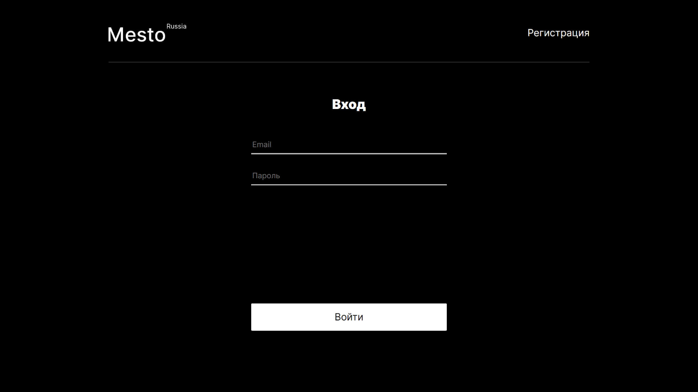
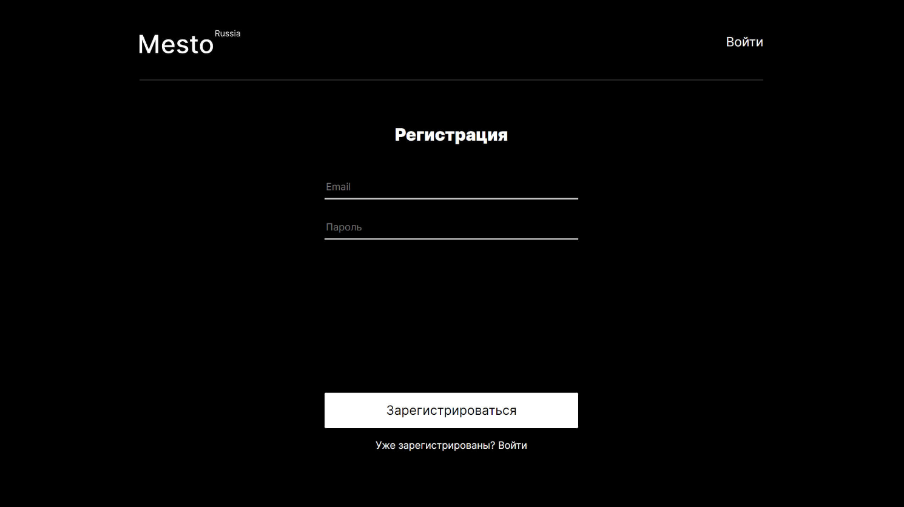

### Описание
Mesto - это компактная интеррактивная страница, где можно размещать информацию о себе, загружать фотографии, лайкать их и удалять. Также, этот функционал доступен для любого стороннего пользователя.

Проект разрабатывался в рамках обучения на Веб-разработчика в Яндекс.Практикум.
Он создавался поэтапно, от простого к сложному. Изначально состоял только из CSS и HTML, позднее добавился JavaScript и проект был подключен к серверу. После чего проект был переписан на React с целью закрепления и полученных навыков и знаний:
* Портирование веб-приложения на «Реакт»;
* Применение декларативного подхода;
* Создание функциональных компонентов;
* Использование «Реакт»-хуков;
* Работа с библиотекой React-router;
* Работа c локальным хранилищем и JWT-токеном

  
  ### Функционал:
* Редактирование аватара и профиля пользователя;
* Добавление фото и лайков под ними;
* Удаление фото и лайков;
* Открытие фото в полном размере;
* Авторизация и регистрация пользователей.

### **Какие технологии использовались**
* HTML
*  CSS:
    - Flex layout;
    - Grid layout;
    - Позиционирование элементов;
    - Адаптация сайта с использованием @media запросов;
* JavaScript:
    - Директивы Export и Import в JS;
    - Работа с сервером (ассинхронность, fetch, Promise, API);
* React JS:
    - Create React App;
    - Портирование разметки в JSX;
    - Функциональные компоненты;
    - Хуки.
* React JS:
    - Create React App;
    - Портирование разметки в JSX;
    - Функциональные компоненты;
    - Библиотека React-router;
    - Хуки.
* Методология БЭМ;
* Файловая структура БЭМ Nested.
* Верстка Pixel Perfect;

### **Установка и запуск проекта**

1. Склонируйте репозиторий на свой компьютер:

`git@github.com:Ksenia-Beznos/react-mesto-auth.git`

2. Установите зависимости:

`npm install`

3. Запустите проект:

`npm run start`

### **Макеты этапов проекта**
* [1 этап](https://www.figma.com/file/2cn9N9jSkmxD84oJik7xL7/JavaScript.-Sprint-4?type=design&node-id=0-1&mode=design)
* [2 этап](https://www.figma.com/file/bjyvbKKJN2naO0ucURl2Z0/JavaScript.-Sprint-5?type=design&node-id=0-1&mode=design)
* [3 этап](https://www.figma.com/file/kRVLKwYG3d1HGLvh7JFWRT/JavaScript.-Sprint-6?type=design&node-id=0-1&mode=design)
* [4 этап](https://www.figma.com/file/PSdQFRHoxXJFs2FH8IXViF/JavaScript.-Sprint-9?type=design&node-id=0-1&mode=design)
* [5 этап](https://www.figma.com/file/5H3gsn5lIGPwzBPby9jAOo/JavaScript.-Sprint-12?type=design&node-id=0-1&mode=design&t=o02SQNtzEYU7dTBJ-0)

**Автор сайта**: Ксения Безнос.
